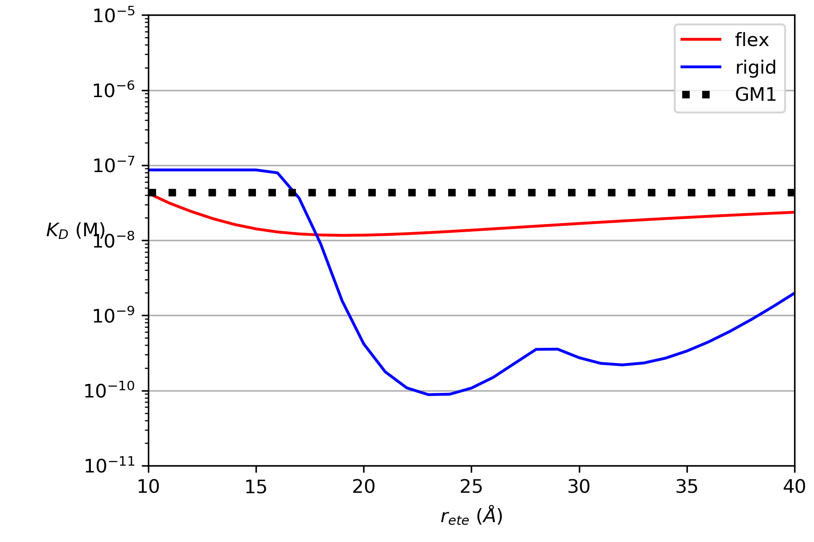

# MultivalentKDPredictor
Mainly for personal use in predicting multivalent dissociation constants for CTB inhibitor, but could also be applied to other systems
## Installation
Simply clone this repository. I may use this repository to learn how to publish to PyPi in the future, in which case you may be able to one day use pip install.
## Purpose
This is primarily for my own use in predicting the binding affinity for bivalent CTB ligands, allthough the general framework could be applied to other systems. The issue is that the most complicated part comes from generating the binding polynomial for a specific system, in this case a hetero-bivalent ligand binding to a receptor with 5 and 5 binding sites. It's likely that I may use this again, however, for calculating the affinity of various multivalent ligands binding to DC-SIGN and so at some point (a very big maybe) might create some function which could automatically generate binding polynomials given constraints of a given system e.g. number of binding sites, number of ligating units per scaffold etc. 
## User Guide
The predictions are made via a python script. A model is created using the systems script e.g.:
```
model = Systems.CTB(polymer_model='gaussian_chain')
```
where optional parameters, such as the polymer model used to calculate the effective concentration can be set. 
The Kd can then be calculated using:
```
model.calculate_kds('macro', rmin=10, rmax=40)
```
where the type of Kd (macro or micro) can be specified along with the minimum and maximum linker lengths, rmin and rmax.
Finally, the Kds can be saved:
```
model.save_kds('example/flex.dat')
```
The example.py shows a case where these commands can be combined with matplotlib to generate a graph which shows the dissociation constant for flexible and rigid bivalent CTB ligands as a function of linker length:

